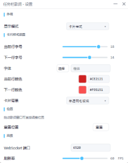
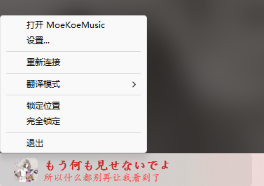
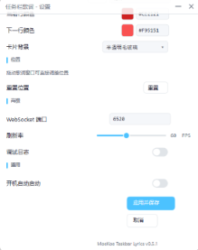
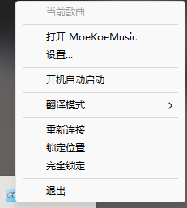

<p align="center">
  
</p>

<h1 align="center">MoeKoeMusic TaskbarLyrics</h1>

<p align="center">
  <a href="https://github.com/Yngu196/TaskbarLyrics/releases/tag/v1.0.0">
    
  </a>
  <a href="https://github.com/Yngu196/TaskbarLyrics?tab=License-1-ov-file">
    
  </a>

</p>

<p align="center">在 Windows 任务栏上显示歌词，支持卡拉OK效果、双行显示歌词封面、播放控制和歌词翻译</p>

***

## 功能特性

> 本项目可能与一些桌面/任务栏美化工具不兼容。
> 目前已知与`腾讯桌面整理`存在一定的兼容问题，在与桌面交互时可能会导致歌词被任务栏覆盖。
> 本项目与TranslucentTB、Wallpaper不存在兼容问题，可放心使用。

- **Native Host 托管** — 随 MoeKoeMusic 自动启动/关闭，无需手动管理
- **卡拉 OK 效果** — 基于 Direct2D + DirectWrite 渲染，逐字高亮渐变
- **卡片样式显示** — 双行歌词 + 封面图标，此模式无歌词高亮、长歌词滚动效果，独立字号和颜色配置
- **悬停控制按钮** — 鼠标悬停歌词时显示 ⏮ ⏸/▶ ⏭
- **拖动定位** — 可在任务栏范围内自由拖动调整位置
- **锁定模式** — 托盘菜单切换锁定位置 / 完全锁定
- **APPBAR 自动隐藏** — 任务栏自动隐藏时歌词窗口跟随显隐（此功能已放弃维护）
- **高 DPI 适配** — Per-Monitor V2 DPI Awareness
- **多方向任务栏** — 支持底部 / 顶部 / 左侧 / 右侧任务栏 (待测试)
- **跑马灯滚动** — 长歌词自动滚动（bounce / loop / off 三种模式）
- **D2D 原生设置界面** — 纯 Direct2D + DirectWrite 自绘设置界面，实时预览，零外部依赖
- **自定义字体** — 可使用本地已安装的字体
- **歌词翻译支持** — 自动解析 KRC `[language:...]` 标签提取翻译数据

## 使用说明

> (如果您在使用过程中遇到问题，可以先查看[常见问题自查](Docs/常见问题自查.md)，如果问题仍然存在，请提交 issue。)

#### 本插件会自动开启 MoeKoeMusic 的API模式，但您需要重启MoeKoeMusic才会生效

### 作为 MoeKoeMusic 插件（推荐）

将发布的压缩包解压后复制到 MoeKoeMusic 的插件目录：

```
C:\Users\用户名\AppData\Roaming\moekoemusic\extensions
```

或者直接在 MoeKoeMusic 的 插件市场 安装此插件。

然后在 MoeKoeMusic 插件管理页找到「任务栏歌词」→ 点击「本地程序授权」。授权后，需重启MoeKoeMusic，之后程序将随 MoeKoeMusic 自动启动/关闭（此功能需MoeKoeMusic版本>1.6.5）。

### 独立运行

双击 `MoeKoeTaskbarLyrics.exe`，右键托盘图标操作，独立运行时建议开启开机自动启动。

## 构建环境

| 工具            | 版本          |
| ------------- | ----------- |
| Windows SDK   | 10.0.26100+ |
| Visual Studio | 2022 (v143) |
| MSVC 工具集      | 14.44+      |
| CMake         | 3.20+       |
| vcpkg         | latest      |

## 构建

```powershell
# 安装依赖
vcpkg install ixwebsocket:x64-windows-142 nlohmann-json:x64-windows-142

# 构建
cmake --preset x64-Release
cmake --build --preset x64-Release

# 打包发布
python scripts\pack_zip.py moeKoe-taskbar-lyrics\ moeKoe-taskbar-lyrics.zip
```

> **注意**：由于 ixwebsocket 预编译库使用 MSVC 14.44 编译，项目需要使用相同版本工具集。`CMakePresets.json` 已配置自动传递 `/p:PlatformToolsetVersion=14.44.35207`。

***

## gif及图片演示

|                 卡片模式                |                  卡拉OK模式                 |                     卡片模式（歌词双语切换）                    |
| :---------------------------------: | :-------------------------------------: | :-------------------------------------------------: |
|  |  |  |

|                 设置页面                |                菜单               |
| :---------------------------------: | :-----------------------------: |
|  |  |
|  |  |

***

## 有关文档

- [MoeKoeMusic\_TaskbarLyrics\_开发文档.md](Docs/MoeKoeMusic_TaskbarLyrics_开发文档.md)
- [项目状态文档.md](Docs/项目状态文档.md)
- [版本更新日志.md](Docs/版本更新日志.md)
- [常见问题自查.md](Docs/常见问题自查.md)
- [计划书.md](Docs/计划书.md)

## 许可证

[GPL-3.0](LICENSE)
