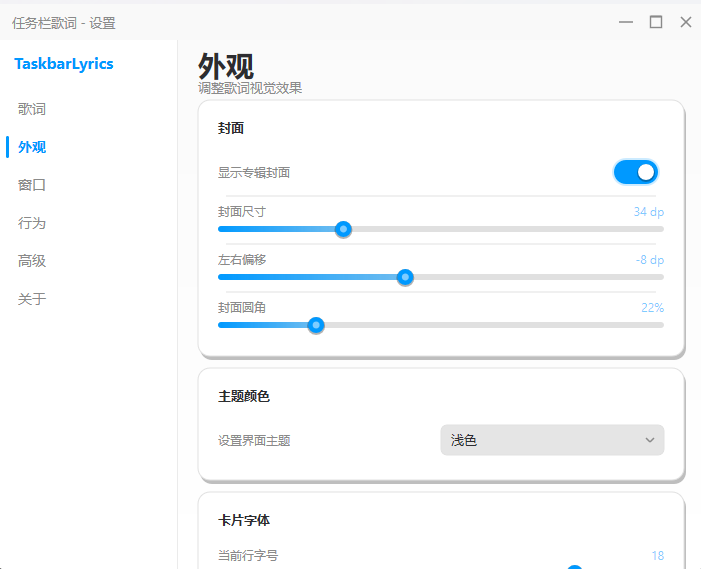
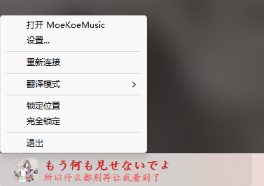
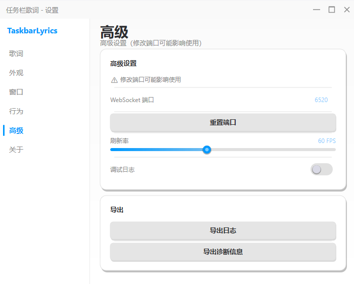

<p align="center">
  
</p>

<h1 align="center">MoeKoeMusic TaskbarLyrics</h1>

<p align="center">
  <a href="https://github.com/Yngu196/TaskbarLyrics/releases/tag/v1.0.6">
    
  </a>
  <a href="https://github.com/Yngu196/TaskbarLyrics?tab=License-1-ov-file">
    
  </a>

</p>

<p align="center">在 Windows 任务栏上显示歌词，支持单行、双行歌词、显示歌曲封面、播放控制和歌词翻译</p>

> MoeKoeMusic TaskbarLyrics 正在收集用户反馈，欢迎在 [GitHub Issues](https://github.com/Yngu196/TaskbarLyrics/issues)/[Discussion](https://github.com/Yngu196/TaskbarLyrics/discussions/17) 提交问题/建议或填写兼容性反馈！
### 如果您遇到不显示歌词的问题，请优先检测MoeKoeMusic的api模式是否开启，如果未开启，请先开启api模式。如果已开启，请关闭后重新开启，然后重启MoeKoeMusic一到两次。如果问题仍然存在，请提交 issue。
***

## 功能特性

> 本项目可能与一些桌面/任务栏美化工具不兼容。
> 目前已知与`腾讯桌面整理`存在一定的兼容问题，在与桌面交互时可能会导致歌词被任务栏覆盖。
> 本项目与TranslucentTB、Wallpaper不存在兼容问题，可放心使用。

- **Native Host 托管** — 随 MoeKoeMusic 自动启动/关闭，无需手动管理
- **单行歌词** — 基于 Direct2D + DirectWrite 渲染，逐字高亮渐变
- **双行歌词** — 双行卡片布局 + 专辑封面（异步下载、圆角裁切、模糊背景）
- **动态频谱显示** — 纯音乐/无歌词时显示频谱条，基于 WASAPI 进程级音频采集，柱数/柱宽/颜色等参数可调
- **歌词切换动画** — 行切换淡入淡出 + 卡拉OK进度弹簧动画
- **歌词位置微调** — 支持单行/双行歌词上下偏移，适配多显示器和特殊任务栏布局
- **悬停控制按钮** — 鼠标悬停歌词时显示 ⏮ ⏸/▶ ⏭
- **拖动定位** — 可在任务栏范围内自由拖动调整位置
- **锁定模式** — 托盘菜单切换锁定位置 / 完全锁定
- **手动窗口宽度** — 任务栏宽度检测异常时可手动指定歌词窗口宽度
- **APPBAR 自动隐藏** — 任务栏自动隐藏时歌词窗口跟随显隐（此功能已放弃维护）
- **多方向任务栏** — 支持底部 / 顶部 / 左侧 / 右侧任务栏（理论上来说是支持的，但未测试）
- **多任务栏智能切换** — 多显示器下按鼠标位置 / 活动窗口所在显示器自动选择任务栏，跨屏移动自动切换绑定；支持手动指定锁定到某一台显示器（设置 → 窗口页，仅多显示器时显示，可自动跟随 / 手动指定两种模式）
- **D2D 原生设置界面** — 纯 Direct2D + DirectWrite 自绘，7 个设置页（歌词 / 外观 / 频谱 / 窗口 / 行为 / 高级 / 关于）
- **四种配色主题** — 蓝 / 深色 / 浅色 / 白色主题，颜色选择器内置预设色板
- **自定义字体** — 可使用本地已安装的字体
- **歌词翻译支持** — 自动解析 KRC `[language:...]` 标签提取翻译数据
- **诊断报告** — 一键导出系统与运行诊断信息，辅助问题排查
- **安全模式降级** — 检测到冲突的任务栏美化工具时自动降级运行
- **配置导入导出** — 支持将配置导出为 JSON 文件，方便分享和恢复

## 使用说明

> 如果您在使用过程中遇到问题，可以先查看[常见问题自查](Docs/常见问题自查.md)，如果问题仍然存在，请提交 issue。
>
> 本项目支持 Windows x64；Windows on ARM64（原生 ARM64）当前处于「发布测试」阶段。目前已发布x64/ARM64混合测试版，程序运行后会自动检测系统架构并选择对应的二进制运行。欢迎反馈。

#### 本插件会自动开启 MoeKoeMusic 的API模式，但您需要重启MoeKoeMusic才会生效

### 作为 MoeKoeMusic 插件（推荐）

将发布的压缩包解压后复制到 MoeKoeMusic 的插件目录：

```
C:\Users\用户名\AppData\Roaming\moekoemusic\extensions
```

或者直接在 MoeKoeMusic 的 插件市场 安装此插件：
- 在 MoeKoeMusic 插件管理页找到「任务栏歌词」→ 点击「本地程序授权」。
- 然后在 MoeKoeMusic 的设置里的“系统”中开启“api模式”（建议手动开启，~~虽然本插件也能开启 MoeKoeMusic 的api模式~~）。
- 重启MoeKoeMusic，之后程序将随 MoeKoeMusic 自动启动/关闭。

### 独立运行（不推荐）

双击 `MoeKoeTaskbarLyrics.exe`，右键托盘图标操作，独立运行时建议开启开机自动启动。

## 构建环境

| 工具            | 版本          |
| ------------- | ----------- |
| Windows SDK   | 10.0.20348+ |
| Visual Studio | 2022 (v143) |
| MSVC 工具集      | 14.44+（构建 ARM64 需安装 ARM64 工具链） |
| CMake         | 3.20+       |
| vcpkg         | latest      |

## 构建

### 一键脚本（推荐）

```powershell
# x64 Release
.\build.cmd release x64
# ARM64 Release（本机需安装 VS2022 ARM64 工具链与 arm64-windows 依赖）
.\build.cmd release arm64
# 全量构建发布包：依次构建 x64 → ARM64 → verify_package 架构校验 → pack_zip 打包
.\build.cmd release all
# 清理
.\build.cmd clean x64
```

> 一键脚本构建时会自动向 CMake 显式传入 `VCPKG_INSTALLED_DIR`：
> x64 → `<vcpkg>\installed\x64-windows`，ARM64 → `<vcpkg>\installed\arm64-windows`，
> 保证所有第三方库与目标架构使用同一 triplet（禁止 -142 等跨 triplet fallback）。

### 手动构建

```powershell
# 安装依赖（推荐使用 vcpkg.json manifest 按目标 triplet 安装：
# ixwebsocket / nlohmann-json / zlib / mbedtls / kissfft 五项）
# x64：
vcpkg install --triplet x64-windows
# ARM64：
vcpkg install --triplet arm64-windows

# 构建（x64，显式传入对应 triplet 的 VCPKG_INSTALLED_DIR）
cmake --preset x64-Release -DVCPKG_INSTALLED_DIR="D:\vcpkg\installed\x64-windows"
cmake --build --preset x64-Release
# 构建（ARM64）
cmake --preset ARM64-Release -DVCPKG_INSTALLED_DIR="D:\vcpkg\installed\arm64-windows"
cmake --build --preset ARM64-Release

# 架构校验（逐文件检查根/Launcher、x64/*、arm64/* 的 PE Machine 字段）
python scripts\verify_package.py moeKoe-taskbar-lyrics\

# 打包发布（pack_zip.py 按目录全量打包，根目录下同时含 x64/ 与 arm64/
# 即为双架构混合包，只需打一个 zip；根启动器 Launcher 由 x64 构建生成）
python scripts\pack_zip.py moeKoe-taskbar-lyrics\ moeKoe-taskbar-lyrics-windows-x64-arm64.zip
```

> **注意**：由于 ixwebsocket 预编译库使用 MSVC 14.44 编译，项目需要使用相同版本工具集。`CMakePresets.json` 已配置自动传递 `/p:PlatformToolsetVersion=14.44.35207`。

***

## gif及图片演示

|                 双行歌词模式                |                  单行歌词模式                 |                     双行歌词（歌词双语切换）                    |
| :---------------------------------: | :-------------------------------------: | :-------------------------------------------------: |
|  |  |  |

|                 设置页面                |                菜单               |
| :---------------------------------: | :-----------------------------: |
|  |  |
|  |  |

***

## 有关文档

- [MoeKoeMusic\_TaskbarLyrics\_开发文档.md](Docs/MoeKoeMusic_TaskbarLyrics_开发文档.md)
- [项目状态文档.md](Docs/项目状态文档.md)
- [版本更新日志.md](Docs/版本更新日志.md)
- [常见问题自查.md](Docs/常见问题自查.md)
- [高DPI测试矩阵.md](Docs/高DPI测试矩阵.md)
- [计划书.md](Docs/计划书.md)

## 许可证

[GPL-3.0](LICENSE)
