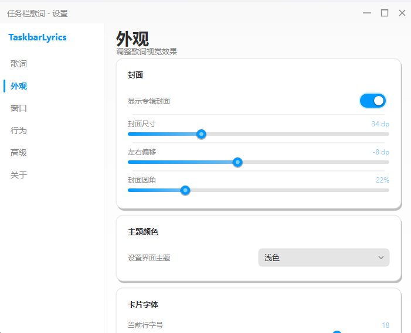
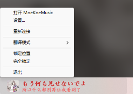

<p align="center">
  
</p>

<h1 align="center">MoeKoeMusic TaskbarLyrics</h1>

<p align="center">
  <a href="https://github.com/Yngu196/TaskbarLyrics/releases/tag/v1.0.8">
    
  </a>
  <a href="https://github.com/Yngu196/TaskbarLyrics?tab=License-1-ov-file">
    
  </a>
  
</p>

<p align="center">把歌词放进 Windows 任务栏：单行 / 双行歌词、专辑封面、播放控制、歌词翻译与纯音乐频谱。</p>

## 目录

- [项目简介](#项目简介)
- [功能特性](#功能特性)
- [兼容性说明](#兼容性说明)
- [安装与使用](#安装与使用)
- [常见问题](#常见问题)
- [构建与测试](#构建与测试)
- [界面预览](#界面预览)
- [相关文档](#相关文档)
- [许可证](#许可证)

## 项目简介

MoeKoeMusic TaskbarLyrics 是 [MoeKoeMusic](https://github.com/MoeKoeMusic/MoeKoeMusic) 的 Windows 任务栏歌词插件。程序以 Native Host 方式运行，通过本地 HTTP / WebSocket 接收播放状态、歌词与封面数据，并使用 Direct2D / DirectWrite 在任务栏中绘制歌词窗口。

- 主要面向 Windows x64，ARM64 原生版本处于发布测试阶段。
- 源代码使用 C++17，构建系统为 CMake Presets，第三方依赖通过 vcpkg 管理。
- 程序可随 MoeKoeMusic 自动启动和退出，也可以独立运行。

> 正在收集兼容性反馈：欢迎在 [GitHub Issues](https://github.com/Yngu196/TaskbarLyrics/issues) 或 [Discussion](https://github.com/Yngu196/TaskbarLyrics/discussions/17) 提交问题与建议。

## 功能特性

### 显示与渲染

- **单行歌词**：Direct2D + DirectWrite 渲染，支持逐字高亮与卡拉 OK 进度动画。
- **双行歌词**：当前行 + 下一行卡片布局，支持专辑封面异步下载、圆角裁切与模糊背景。
- **纯音乐频谱**：无歌词时显示频谱条，基于 WASAPI 进程级音频采集；柱数、柱宽、颜色、上下限与透明度均可调整。
- **歌词翻译**：解析 KRC `[language:...]` 标签提取翻译内容，支持单行替换或双行对照。
- **切换动画**：行切换淡入淡出，进度变化使用弹簧动画过渡。

### 交互与窗口

- **悬停控制**：鼠标悬停时显示上一首 / 播放暂停 / 下一首按钮，单行模式显示歌曲名，双行模式第一行显示歌曲名、第二行显示歌手，移开后自动恢复。
- **拖动定位**：可在任务栏范围内拖动调整歌词窗口位置。
- **锁定模式**：通过托盘菜单切换“锁定位置”或“完全锁定”。
- **手动窗口宽度**：任务栏宽度检测异常时，可手动指定歌词窗口宽度。
- **上下偏移微调**：支持单行 / 双行歌词垂直微调，适配特殊任务栏布局与多显示器环境。

### 适配与数据

- **多方向任务栏**：支持底部 / 顶部 / 左侧 / 右侧任务栏（非底部方向测试偏少，可能会出现一些问题，欢迎反馈）。
- **多显示器跟随**：按鼠标位置或活动窗口所在显示器绑定任务栏，跨屏移动时自动切换；也可在「设置 → 窗口」中手动锁定显示器。
- **APPBAR 自动隐藏**：任务栏自动隐藏时歌词窗口跟随显隐（该功能已停止维护）。
- **封面与元数据**：兼容 `artist` / `author` 等歌曲字段，歌词、封面、歌名与歌手会在独立消息之间保持合并，避免被进度消息清空。

### 诊断与配置

- **诊断报告**：一键导出系统信息、运行状态与日志，便于排查问题。
- **配置导入 / 导出**：支持导出为 JSON 并在其他设备导入。
- **示例配置**：[TaskbarLyrics-config.json](TaskbarLyrics-config.json) 可直接下载替换，或在设置中导入。

## 兼容性说明

- 本项目可能与部分桌面 / 任务栏美化工具存在兼容问题。
- 若任务栏位置或显隐异常，可先关闭桌面 / 任务栏美化工具再排查。

## 安装与使用

### 前置条件

1. 安装 MoeKoeMusic **1.6.6 或更高版本**。
2. 在 MoeKoeMusic 设置 → 系统中开启 **API 模式**。
3. 修改 API 模式后需要重启 MoeKoeMusic（建议重启 1–2 次）才会生效。

### 方式一：插件市场安装（推荐）

1. 在 MoeKoeMusic 的插件管理页找到「任务栏歌词」。
2. 点击「本地程序授权」。
3. 确认已开启 API 模式，然后重启 MoeKoeMusic。

安装完成后，任务栏歌词程序会随 MoeKoeMusic 自动启动和关闭。

### 方式二：手动安装

将发布包解压到 MoeKoeMusic 的插件目录：

```
%APPDATA%\moekoemusic\extensions
```

解压后目录中应直接包含 `manifest.json` 以及 `x64` / `arm64` 等子目录。随后重启 MoeKoeMusic。

### 方式三：独立运行（不推荐）

双击 `MoeKoeTaskbarLyrics.exe`，通过托盘图标打开设置或退出程序。独立运行时建议开启开机自动启动。

## 常见问题排查

请参阅 [常见问题自查](Docs/常见问题自查.md)。

## 构建与测试

### 构建环境

| 工具 | 版本 |
| --- | --- |
| Windows SDK | 10.0.20348+ |
| Visual Studio | 2022 (v143) |
| MSVC 工具集 | 14.44+（构建 ARM64 需安装 ARM64 工具链） |
| CMake | 3.20+ |
| vcpkg | 由 `scripts\bootstrap.ps1` 自动准备，可用 `-VcpkgCommit` 锁定版本 |

### 使用 Visual Studio

1. 安装 Visual Studio 2022，勾选「使用 C++ 的桌面开发」、Windows SDK 与 CMake 工具。
2. **先执行一次** `.\scripts\bootstrap.ps1 -Arch x64`，生成 `.vcpkgroot` 并安装依赖。
3. 用 Visual Studio 打开项目根目录的 `CMakeLists.txt`，等待 CMake 配置完成。
4. 在顶部配置栏选择 `x64-Release`、`x64-Debug`、`ARM64-Release` 或 `ARM64-Debug`，不要选择「无配置」。
5. 选择「生成 → 生成全部」，或右键 `MoeKoeTaskbarLyrics` 目标并选择「生成」。
6. 调试前关闭旧的 `MoeKoeTaskbarLyrics.exe` 进程，避免输出文件被占用。
7. 测试目标可在「测试资源管理器」中运行。

如果「配置任务 / CMake 设置」不可用，关闭解决方案后重新打开 `CMakeLists.txt`；仍未恢复时删除对应的 `out/build/<preset>` 缓存并重新配置。

### 从干净克隆到构建（推荐）

```powershell
git clone --recurse-submodules <repo>
cd MoeKoeMusic-TaskbarLyrics

# 第一步：准备依赖（自动复用已有 vcpkg；找不到才 clone 到 %LOCALAPPDATA%）
# 克隆时漏了 --recurse-submodules 也没关系，bootstrap 会自动补 submodule
.\scripts\bootstrap.ps1 -Arch x64 -Build

# 之后每次构建只需这一条，无需任何用户级环境变量
.\build.cmd release x64

# ARM64（需 VS2022 ARM64 工具链）
.\scripts\bootstrap.ps1 -Arch arm64 -Build

# 全量发布包：x64 → ARM64 → 架构校验 → 打包
# （先分别 bootstrap 两个架构，再执行）；另需 Python 3
.\build.cmd release all

# 清理
.\build.cmd clean x64
```

`bootstrap.ps1` 会把选定的 vcpkg 根目录写入 `.vcpkgroot`（已被 git 忽略）。
`build.cmd` 与 `CMakeLists.txt` 都读取这个文件，因此**命令行与 Visual Studio IDE 解析到同一套依赖**，
不再依赖 `VCPKG_ROOT` 之类的机器级环境变量。解析顺序：

1. `VCPKG_INSTALLED_DIR` 环境变量（仅在手动指定时临时设置，不要设成用户级常量）
2. `VCPKG_INSTALLATION_ROOT` / `VCPKG_ROOT` 环境变量
3. `.vcpkgroot`
4. `D:\vcpkg` / `C:\vcpkg`（兼容旧环境的最后兜底）

第三方库始终按目标 triplet（`x64-windows` / `arm64-windows`）严格校验，禁止跨架构混用。
需要复现特定依赖树时加 `-VcpkgCommit <sha>`（只对全新 clone 生效，不会擅自切换已有的 vcpkg 树）。
构建前可跑只读自检：`.\scripts\check_build_env.ps1 -Arch x64`。

### VC++ 运行时 DLL 不入库

`msvcp140.dll` / `vcruntime140.dll`（x64 另含 `vcruntime140_1.dll`）**不随仓库分发**，
构建时从本机 Visual Studio 的 `VC\Redist\MSVC\<版本>\<架构>\Microsoft.VC143.CRT` 取得：

- 本地构建：`CMakeLists.txt` 的 POST_BUILD 步骤自动复制；
- CI：`scripts\copy_vc_runtime.ps1` 负责补齐，两条 workflow 复用同一脚本，逐文件校验
  PE 架构，找不到就明确失败，不会静默产出缺 CRT 的包。

脚本用 `vswhere` 定位 VS，不依赖 `VCToolsRedistDir` 等机器级环境变量，并打印全部候选目录便于排查。
若构建机确实缺少对应架构的 CRT（尤其 ARM64），请在 Visual Studio Installer 中补齐该架构的
MSVC 生成工具与 VC++ 可再发行组件，**不要**把 DLL 提交进仓库：这些文件受微软再分发条款约束，
且混入错误架构时会直接触发 `verify_package.py` 失败。

### 手动构建

```powershell
# 依赖仍由 bootstrap.ps1 准备，只是构建改用 CMake preset
.\scripts\bootstrap.ps1 -Arch x64
cmake --preset x64-Release
cmake --build --preset x64-Release

.\scripts\bootstrap.ps1 -Arch arm64
cmake --preset ARM64-Release
cmake --build --preset ARM64-Release
```

> 默认不强制 MSVC 工具集版本，由 Visual Studio 自行选择。若 vcpkg 静态库与当前工具集出现链接不兼容，
> 可显式指定：`$env:MKK_TOOLSET_VERSION='14.44.35207'; .\build.cmd release x64`。

### 测试、校验与打包

```powershell
# 测试默认关闭（避免每次 configure 联网探测 Catch2），首次需显式开启
cmake --preset x64-Release -DBUILD_TESTING=ON
cmake --build --preset x64-Release
ctest --test-dir out\build\x64-Release -C Release --output-on-failure

# 架构校验：逐文件检查根目录 / Launcher、x64、arm64 的 PE Machine 字段
python scripts\verify_package.py moeKoe-taskbar-lyrics\

# 打包：根目录同时包含 x64/ 与 arm64/ 即为双架构混合包
python scripts\pack_zip.py moeKoe-taskbar-lyrics\ moeKoe-taskbar-lyrics-windows-x64-arm64.zip
```

`BUILD_TESTING` 默认 `OFF`；已有 `out\build\<preset>` 缓存会保留原值，所以开启一次后后续 `.\build.cmd release x64` 仍会连带构建测试。CI 的 x64 build job 显式传 `-DBUILD_TESTING=ON` 并跑 `ctest`，ARM64 job 在 x64 runner 上无法执行测试二进制，只构建不跑。

当前测试覆盖歌词解析、KRC 解析、频谱数学映射与 HTTP 服务生命周期。WASAPI、Direct2D 设备丢失与 Explorer 重启属于真实 Windows 环境集成测试范围。

## 界面预览

| 双行歌词模式 | 单行歌词模式 | 双行歌词（双语切换） |
| :---: | :---: | :---: |
|  |  |  |

| 设置页面 | 歌词窗口菜单 |托盘菜单 |
| :---: | :---: | :---: |
|  |  |  |

## 相关文档

- [开发文档](Docs/MoeKoeMusic_TaskbarLyrics_开发文档.md)
- [项目状态文档](Docs/项目状态文档.md)
- [版本更新日志](Docs/版本更新日志.md)
- [常见问题自查](Docs/常见问题自查.md)
- [高 DPI 测试矩阵](Docs/高DPI测试矩阵.md)
- [计划书](Docs/计划书.md)

## 许可证

[GPL-3.0](LICENSE)
